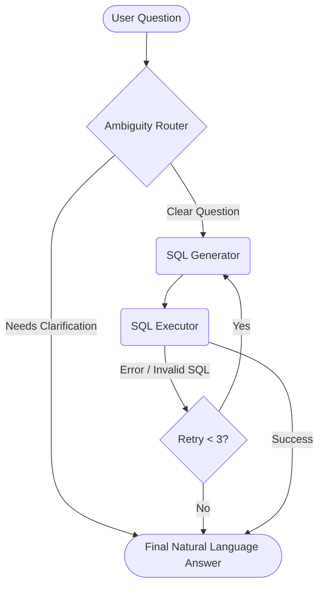

# 🗄️ Text-to-SQL Agent Harness

[](https://www.python.org/downloads/)
[](https://opensource.org/licenses/MIT)
[](https://github.com/jrdyfrdy/sql-agent-harness)
[](http://makeapullrequest.com)

A production-oriented Text-to-SQL harness built with **LangGraph**, **DuckDB**, **FastAPI**, and **Pydantic**.

Connect this agent to your own database, and it will accept natural-language questions, use a configurable LLM to determine if clarification is needed, generate DuckDB SQL, execute it in a secure sandbox, and return a structured response. It features a built-in self-healing loop that utilizes DuckDB error messages to repair failed queries on the fly.

**Perfect for:** Building internal BI chatbots, querying your own DuckDB databases with natural language, learning LangGraph workflows, or evaluating local/cloud LLMs for SQL generation.

## 📑 Table of Contents

- [Features](#-features)
- [Architecture Overview](#-architecture-overview)
- [Requirements](#-requirements)
- [Installation & Setup](#-installation--setup)
- [Usage](#-usage)
- [Troubleshooting](#-troubleshooting)
- [Contributing](#-contributing)
- [Project Structure](#-project-structure)
- [Roadmap](#-roadmap)

## ✨ Features

- **Database-Agnostic Architecture**: The core agent logic is entirely decoupled from the underlying database. You define your schema, business rules, and few-shot examples in a simple `db_config.yaml` file, and the agent adapts instantly.
- **Bring Your Own Database (BYOD)**: Easily configure the agent to query your own custom DuckDB database.
- **Ready-to-Use Sandbox**: Don't have a database handy? Use the included setup script to generate a dummy `ecommerce.db` with realistic mock data for immediate testing and prototyping.
- **Intelligent Query Generation**: Uses a configurable LLM provider to handle clarification decisions, generate structured DuckDB SQL, and summarize results.
- **Multi-Provider Support**: Seamlessly switch between Gemini, OpenAI-compatible chat models, Anthropic, or Ollama for locally deployed models.
- **Agentic Workflow**: Routes questions through a LangGraph workflow with a self-correction loop that can retry SQL generation up to three times upon execution errors.
- **Strict Security Guardrails**: Rejects unsafe or multi-statement SQL before it reaches DuckDB and executes all queries in a read-only sandbox.
- **RESTful API**: Exposes a clean, single `POST /ask` endpoint through FastAPI.

## 🧠 Architecture Overview

The graph state tracks conversational fields alongside a structured SQL payload model (`SqlGeneration`), keeping SQL generation strongly typed.



**Security Guardrails:**
The executor is intentionally conservative. It allows only a single `SELECT` or `WITH` statement. Multi-statement SQL is rejected, non-read-only statements (`DROP`, `INSERT`, `UPDATE`) are blocked, and DuckDB is strictly opened in `read_only=True` mode.

## 📦 Requirements

- Python 3.14+
- DuckDB
- FastAPI & Uvicorn
- Pydantic 2
- LangGraph & LangChain Core
- langchain-google-genai
- python-dotenv
- PyYAML

## 🚀 Installation & Setup

**1. Clone the repository**

```bash
git clone https://github.com/jrdyfrdy/sql-agent-harness.git
cd sql-agent-harness
```

**2. Set up the virtual environment**
Create and activate a virtual environment, then install the dependencies:

```bash
python -m venv venv
source venv/bin/activate  # On Windows use: venv\Scripts\activate
pip install -r requirements.txt
```

**3. Configure Environment Variables**
Copy the sample environment file and configure your preferred provider:

```bash
cp .env.sample .env
```

Key variables in `.env`:

- `LLM_PROVIDER`: Set to `gemini`, `openai`, `anthropic`, or `ollama`.
- `OLLAMA_BASE_URL`: Required only if using a local Ollama server (e.g., `http://localhost:11434`).
- `DB_PATH`: Update this path to point to your own DuckDB database, or leave it as `./ecommerce.db` to use the dummy sandbox data.
- `DB_CONFIG_PATH`: Update this path to point to your custom YAML configuration file, or leave it as `./db_config.yaml` to use the dummy sandbox data configuration.

**4. Generate the Dummy Database (Optional)**
If you are not using your own database, you can generate and seed the local dummy DuckDB database:

```bash
python data/setup_db.py
```

_By default, this creates `ecommerce.db` in the project root._

## 💻 Usage

**Start the API Server**
Start the FastAPI app directly with Uvicorn:

```bash
uvicorn main:app --reload
```

_(Alternatively, you can run the module directly via Python:)_

```bash
python main.py
```

### API Endpoints

**Health Check**

```bash
curl http://127.0.0.1:8000/health
```

**Response:** `{ "status": "ok" }`

**Ask a Question**
Send a natural-language question about your database (or the dummy ecommerce database).

```bash
curl -X POST http://127.0.0.1:8000/ask \
     -H "Content-Type: application/json" \
     -d '{"question": "Show completed order revenue for July 2024"}'
```

**Response Output:**

```json
{
  "question": "Show completed order revenue for July 2024",
  "needs_clarification": false,
  "clarification_message": "",
  "sql_query": "SELECT ROUND(SUM(line_total), 2) AS revenue FROM order_facts WHERE status = 'completed';",
  "db_result": "[{\"revenue\":1910.77}]",
  "error_message": "",
  "retry_count": 0,
  "final_answer": "Question: Show completed order revenue for July 2024\nResult: [{\"revenue\":1910.77}]"
}
```

## 🛠️ Troubleshooting

- **DuckDB Lock Error (`IO Error: Could not set lock on file`)**: DuckDB allows only one process to hold a write lock. Ensure no other scripts or database viewers (like DBeaver) are connected to your database without read-only mode enabled.
- **Ollama Connection Refused**: If `LLM_PROVIDER=ollama`, ensure the Ollama application is running in the background and the model specified in `LLM_MODEL` has been pulled (`ollama pull <model-name>`).

## 🤝 Contributing

Contributions are welcome! If you'd like to improve the harness:

1. Fork the repository.
2. Create a new feature branch (`git checkout -b feature/amazing-feature`).
3. Commit your changes (`git commit -m 'Add some amazing feature'`).
4. Push to the branch (`git push origin feature/amazing-feature`).
5. Open a Pull Request.

**Running Tests**
_(To do: Add test execution command here once tests are implemented, e.g., `pytest tests/`)_

## 📂 Project Structure

```text
sql-agent-harness/
├── agent/
│   ├── __init__.py        # Package initialization
│   ├── edges.py           # Route helpers for conditional graph edges
│   ├── graph.py           # Graph compilation and demo stream helper
│   ├── llm.py             # LLM provider configuration and instantiation
│   ├── nodes.py           # Ambiguity routing, SQL generation, execution, summarization
│   └── state.py           # Typed graph state and SQL generation schema
├── data/
│   └── setup_db.py        # Recreates and seeds ecommerce.db
├── .env                   # Local environment variables (git ignored)
├── .env.sample            # Template for local environment variables
├── .gitignore             # Specifies intentionally untracked files
├── config.py              # Configuration loader for the YAML file
├── db_config.yaml         # Externalized database schema and rules
├── ecommerce.db           # Generated DuckDB database file (git ignored)
├── LICENSE                # Open source license
├── main.py                # FastAPI app and /ask endpoint
├── README.md              # Project documentation
└── requirements.txt       # Project dependencies
```

_(Note: `venv/` and `__pycache__/` directories are intentionally excluded from this tree as they are system/generated folders)._

## 🗺️ Roadmap

Planned next improvements:

- Refine system prompts for clarification and SQL generation.
- Add richer SQL validation and result formatting.
- Add caching for repeated questions.
- Add more comprehensive tests around edge cases and query repair.

## 📄 License

See [LICENSE](LICENSE).
